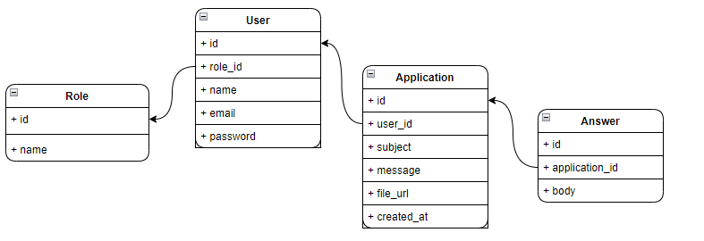

<p align="center"><a href="https://laravel.com" target="_blank"></a></p>


## Task Laravel

Laravel is a web application framework with expressive, elegant syntax. We believe development must be an enjoyable and creative experience to be truly fulfilling.
Laravel is accessible, powerful, and provides tools required for large, robust applications.

## Project install
```
- pc .env.example .env

- composer install

- npm install

- php artisan key:generate

- php artisan migrate --seed

- php artisan storage:link

- php artisan queue:work

- php artisan serve

- npm run dev
```
## .env
- DB_HOST=name
- MAIL_MAILER=log

## DB struktura


## User email
user: manage@tasks.com \
password: manage

## Contributing

Kodga qo'shimcha qo'shish uchun [Laravel documentation](https://laravel.com/docs/contributions) ga murojaat qiling.

## License

The Laravel project software licensed under the [MIT license](https://opensource.org/licenses/MIT).
